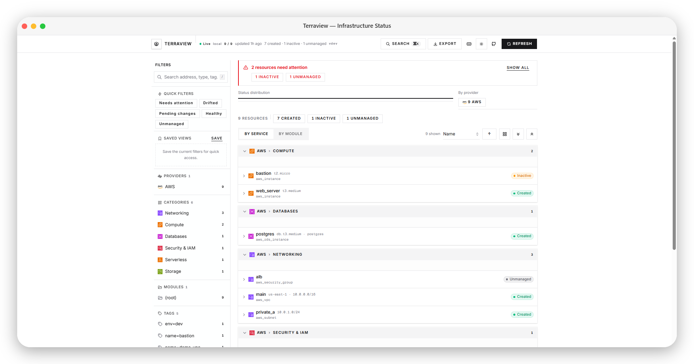

<div align="center">

```
████████╗███████╗██████╗ ██████╗  █████╗ ██╗   ██╗██╗███████╗██╗    ██╗
╚══██╔══╝██╔════╝██╔══██╗██╔══██╗██╔══██╗██║   ██║██║██╔════╝██║    ██║
   ██║   █████╗  ██████╔╝██████╔╝███████║██║   ██║██║█████╗  ██║ █╗ ██║
   ██║   ██╔══╝  ██╔══██╗██╔══██╗██╔══██║╚██╗ ██╔╝██║██╔══╝  ██║███╗██║
   ██║   ███████╗██║  ██║██║  ██║██║  ██║ ╚████╔╝ ██║███████╗╚███╔███╔╝
   ╚═╝   ╚══════╝╚═╝  ╚═╝╚═╝  ╚═╝╚═╝  ╚═╝  ╚═══╝  ╚═╝╚══════╝ ╚══╝╚══╝
```



**A self-hostable, git-native dashboard for Terraform resource status.**  
Parse HCL + state (+ optional plan), classify every resource, and browse it in a live web UI.

[](https://golang.org)
[](LICENSE)
[](CONTRIBUTING.md)

</div>

---

## What is Terraview?

Terraview reads your Terraform project — `.tf` files, state backend, and optionally a JSON plan — then renders a **live status grid** grouped by cloud provider and service type. No SaaS account required: run a single binary locally, in Docker, or behind your CI pipeline.

**Backend:** Go engine + HTTP API + background poller  
**Frontend:** Next.js dashboard (shadcn / radix-sera preset)

---

## Why Terraview?

| Pain | Terraview's answer |
|---|---|
| `terraform state list` is a flat text dump | Visual grid grouped by provider › service (or module) |
| GUI tools are often SaaS or enterprise-only | Self-hosted binary; optional basic auth |
| Hard to see pending vs applied at a glance | Eight lifecycle statuses with filters and summary chips |
| Drift only visible after `terraform plan` | Plan JSON `resource_drift` surfaced as **drifted** status |
| Sharing infra status with non-engineers | Shareable filter URLs; export JSON/CSV |

---

## Features

### Engine & backends

- **Zero-config local mode** — point at a directory; discovers `.tf` files and `terraform.tfstate`
- **Multi-backend state** — local, S3, GCS, Azure Blob, Terraform Cloud / HCP Terraform
- **Plan ingestion** — optional `plan_file` (`terraform show -json`) for pending changes and drift
- **Plan & drift metadata** — `plan_action` and `drift_attributes` on each resource when a plan is loaded
- **State metadata** — `state_serial` and `state_modified_at` on snapshots (local backend mtime)
- **Eight lifecycle statuses** — `created`, `inactive`, `pending_create`, `pending_update`, `pending_destroy`, `drifted`, `unmanaged`, `unknown`
- **Auto-categorization** — AWS / GCP / Azure / Kubernetes → Compute, Networking, Databases, Storage, IAM, Serverless, …
- **Module-aware** — shows module path per resource
- **Live polling** — background refresh (default 30s) + SSE push to the UI
- **CI mode** — `terraview status` prints JSON or Markdown; exit code `2` when drift is detected

### Dashboard (UI)

- **Filter sidebar** — search, provider, category, module, and tag facets
- **Quick filters** — Needs attention, Drifted, Pending changes, Healthy, Unmanaged
- **Saved views** — persist named filter sets in the browser
- **Shareable URLs** — filters sync to query params (`?status=drifted&provider=AWS`)
- **Summary bar + status distribution** — clickable status chips and segment bar
- **Attention banner** — highlights resources that need action
- **Group by service or module** — toggle grid grouping; preference saved locally
- **Sort & density** — sort by name, status, type, or address; compact row mode
- **Collapsible groups** — expand/collapse all resource sections
- **Resource detail sheet** — full metadata, tags, copy address, Terraform CLI hints, plan action & drift attributes
- **Provider breakdown chart** — clickable bar chart by cloud provider
- **State info bar** — state serial and last-modified timestamp from backend
- **CI headline in header** — live status summary from `/api/status`
- **Tag filter from detail** — click a tag in the detail sheet to filter the grid
- **Markdown export** — download filtered resources as a Markdown report
- **Cloud service icons** — official AWS/GCP/Azure SVGs via `@thesvg/cli` (group headers, rows, provider chips)
- **Deep links** — `#resource=aws_instance.web` opens the detail panel
- **Command palette** — `Ctrl+K` / `⌘K` to jump to any resource
- **Keyboard shortcuts** — `/` search, `r` refresh, `Esc` clear filters, `?` help
- **Export** — download filtered resources as JSON or CSV; copy view link
- **Live connection badge** — Live / Polling / Offline SSE status in the header
- **Theme toggle** — light, dark, or system
- **Optional auth UI** — login form when basic auth is enabled

### API

| Endpoint | Description |
|---|---|
| `GET /api/health` | Liveness + version |
| `GET /api/snapshot` | Full snapshot (resources, summary, UI config) |
| `GET /api/resources` | Filtered resource list (`?status=&provider=&module=&category=&tag=&q=&limit=&offset=`) |
| `GET /api/resource` | Single resource by address (`?address=aws_instance.web`) |
| `GET /api/facets` | Filter facet counts (optionally pre-filtered) |
| `GET /api/summary` | Aggregate counts only |
| `GET /api/status` | Compact headline for badges / CI |
| `POST /api/refresh` | Force refresh |
| `GET /api/events` | SSE stream (`refreshed` events) |
| `POST /api/login` | Exchange credentials for session token (when auth enabled) |

---

## Quick start

### Prerequisites

- Go **1.25+** (to build from source)
- Node **20+** (UI development only)

### Binary

```bash
git clone https://github.com/NotHarshhaa/terraview
cd terraview

go run ./cmd/terraview serve ./testdata/sample-project
# API + UI (if ui/out exists) → http://localhost:7777
```

### Development (API + UI)

Use two terminals — the UI proxies `/api/*` to the Go server via Next.js rewrites (no CORS setup needed):

```bash
# Terminal 1 — API
go run ./cmd/terraview serve ./testdata/sample-project --no-ui

# Terminal 2 — UI
cd ui && npm install && npm run dev
# → http://localhost:3000
```

Or use the Makefile:

```bash
make run          # build + serve sample project on :7777
make ui-dev       # Next.js on :3000 (requires API on :7777)
make test         # go test ./...
```

### Docker

```bash
docker compose up --build
# or pull the published image:
docker pull ghcr.io/notharshhaa/terraview:latest
docker run -p 7777:7777 -v "$(pwd):/workspace" ghcr.io/notharshhaa/terraview:latest
```

Images are built and published to [GHCR](https://github.com/NotHarshhaa/terraview/pkgs/container/terraview) when you:

- **Create a version tag** — e.g. `git tag v0.1.0 && git push origin v0.1.0` (publishes `v0.1.0`, `0.1.0`, `0.1`, and `latest`)
- **Run the workflow manually** — Actions → *Publish Docker image* → *Run workflow* (publishes `sha-<commit>`; optionally check *Also tag as latest*)

### CI / PR comments

Use the published **[Terraview Status Check](https://github.com/NotHarshhaa/terraview-action)** GitHub Action (Marketplace) or the CLI directly.

**GitHub Actions:**

```yaml
permissions:
  contents: read
  pull-requests: write

jobs:
  terraview:
    runs-on: ubuntu-latest
    steps:
      - uses: actions/checkout@v4

      - uses: NotHarshhaa/terraview-action@v1
        with:
          working-directory: ./infra
          mode: status-check          # also: drift-gate, destroy-guard, summary-report
          plan-file: ./plan.json
          # backend: s3
```

| Mode | Behavior |
|---|---|
| `status-check` | Post/update PR comment with resource table (read-only) |
| `drift-gate` | Fail when drift is detected (exit 2) |
| `destroy-guard` | Fail when any `pending_destroy` resources exist |
| `summary-report` | Write JSON/HTML report files for pipeline artifacts |

See the [terraview-action README](https://github.com/NotHarshhaa/terraview-action) for full inputs and workflow examples.

**CLI-only CI** (no Action wrapper):

```bash
terraview status ./infra --format markdown
terraview status ./infra --plan-file ./plan.json   # includes pending + drift
# Exit 2 if any resource is drifted
```

See [`.terraview.yaml.example`](.terraview.yaml.example).

---

## Status classification

Each resource is classified from HCL declarations, state, and plan:

```
In state?
├── NO  → in plan as create?  → pending_create
│         declared in .tf?    → unmanaged
│         else                → unknown
└── YES → in plan?
│         ├── delete          → pending_destroy
│         ├── update/replace  → pending_update
│         └── create          → pending_create
          drift in plan?        → drifted
          provider inactive?    → inactive
          else                  → created
```

**Drift detection** reads the `resource_drift` section from a Terraform plan JSON file. Pass it via `plan_file` in config or `--plan-file` on the CLI.

---

## Configuration

Copy [`.terraview.yaml.example`](.terraview.yaml.example) to your project root. All fields are optional.

```yaml
port: 7777
poll_interval: 30s
working_dir: .
plan_file: ./plan.json          # optional: terraform show -json output

backend:
  type: local                   # local | s3 | gcs | azureblob | tfc
  # S3: bucket, key, region, dynamodb_table, endpoint
  # GCS: bucket, key
  # Azure: storage_account, container, key
  # TFC: organization, workspace, token, hostname

ui:
  title: "My Project — Infrastructure"
  show_cost_column: false       # reserved for future Infracost integration
  default_filter: status=created

auth:
  enabled: false
  username: admin
  password_env: TV_PASSWORD
  access_token: secret-token    # Bearer / ?access_token= for SSE
```

### Environment variables

| Variable | Default | Description |
|---|---|---|
| `TV_PORT` | `7777` | HTTP port |
| `TV_POLL_INTERVAL` | `30s` | Snapshot refresh interval (min 5s) |
| `TV_WORKING_DIR` | `.` | Terraform project root |
| `TV_BACKEND` | `local` | Backend type |
| `TV_STATE_BUCKET` | — | S3/GCS bucket |
| `TV_STATE_KEY` | — | State object key |
| `TV_STATE_REGION` | — | AWS region (S3) |
| `TV_STATE_FILE` | — | Explicit local state path |
| `TV_PLAN_FILE` | — | Plan JSON path |
| `TV_UI_TITLE` | `Terraview` | Dashboard title |
| `TV_PASSWORD` | — | Basic auth password |
| `TV_ACCESS_TOKEN` | — | Static API token (SSE-friendly) |
| `TFE_TOKEN` | — | Terraform Cloud token |

### Auth

When `auth.enabled: true`, the API accepts:

- HTTP **Basic** auth (`username` / `password`)
- **Bearer** token header (`access_token` or session token from login)
- **`?access_token=`** query param (required for browser EventSource / SSE)
- **Session cookie** from `POST /api/login`

The UI stores credentials in `sessionStorage` and shows a login form on `401`.

---

## Supported backends

| Backend | Status | Notes |
|---|---|---|
| Local (`terraform.tfstate`) | Supported | Default; also checks `.terraform/terraform.tfstate` |
| Amazon S3 | Supported | AWS SDK v2; optional S3-compatible `endpoint` |
| Google Cloud Storage | Supported | Application Default Credentials |
| Azure Blob Storage | Supported | `DefaultAzureCredential` |
| Terraform Cloud / HCP | Supported | HTTP API; set `TFE_TOKEN` or `backend.token` |

---

## Contributing

See [CONTRIBUTING.md](CONTRIBUTING.md). High-impact areas:

- Provider category mappings (new resource types)
- Plan / drift edge cases
- Remote backend hardening (locks, retries)
- Infracost cost column integration

```bash
git clone https://github.com/NotHarshhaa/terraview
cd terraview

go test ./...
go vet ./...

cd ui && npm run typecheck && npm run build
```

---

## Related projects

- [`devops-project-generator`](https://github.com/NotHarshhaa/devops-project-generator) — scaffold DevOps project structures
- [`terraform-cost-estimator`](https://github.com/NotHarshhaa/terraform-cost-estimator) — cost estimation for Terraform plans
- [`jenkins-plus`](https://github.com/NotHarshhaa/jenkins-plus) — batteries-included Jenkins with modern UI

---

## License

Apache 2.0 — see [LICENSE](LICENSE)

---

<div align="center">
Built by <a href="https://github.com/NotHarshhaa">@NotHarshhaa</a>
</div>
